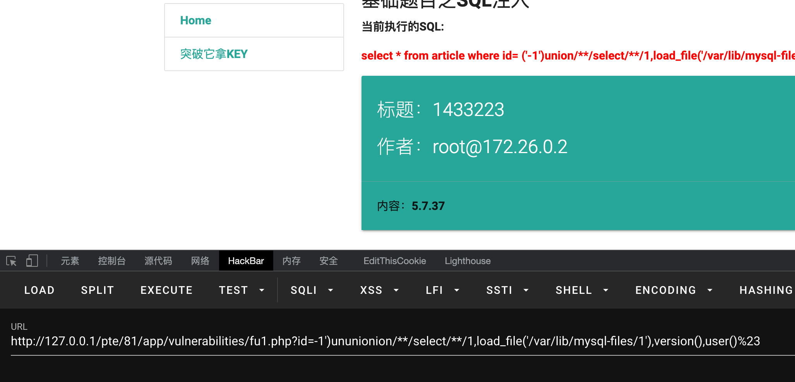
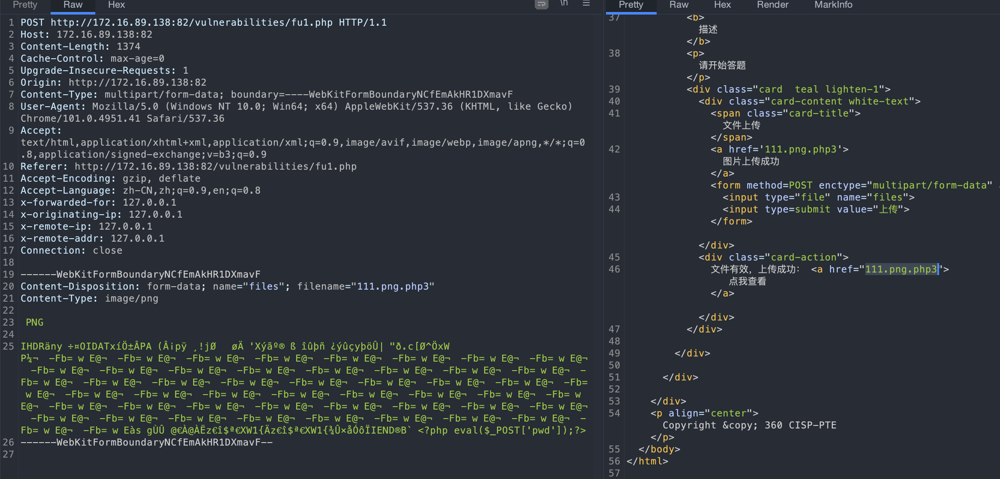
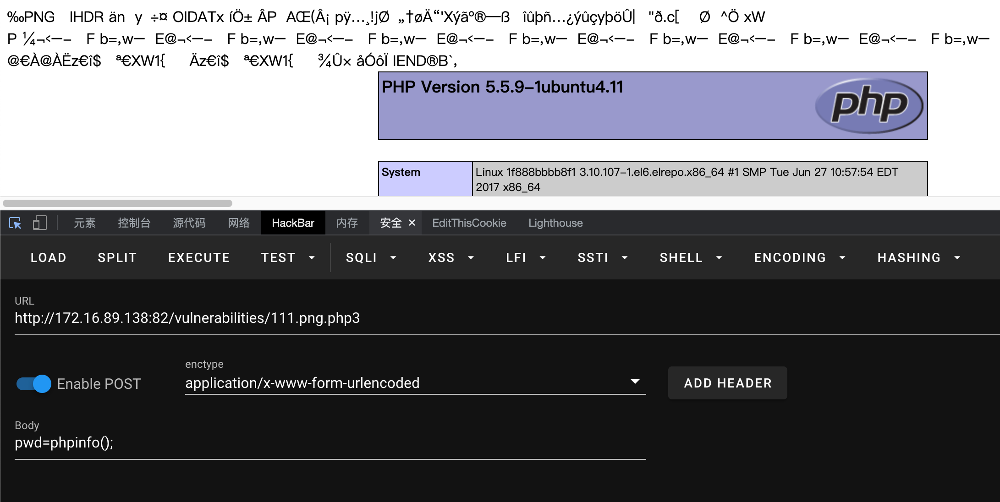
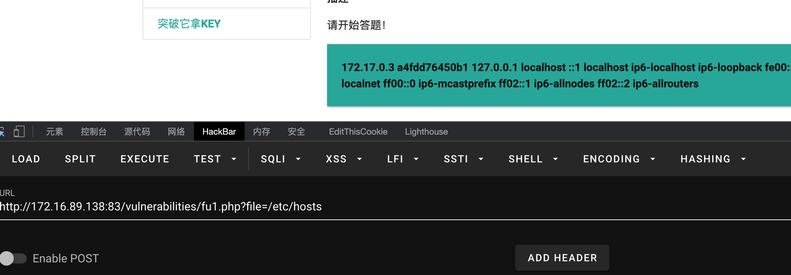
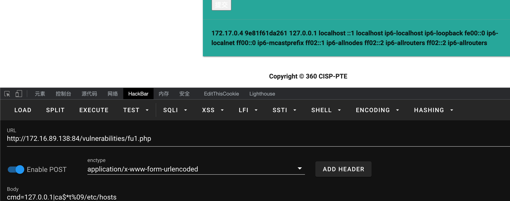
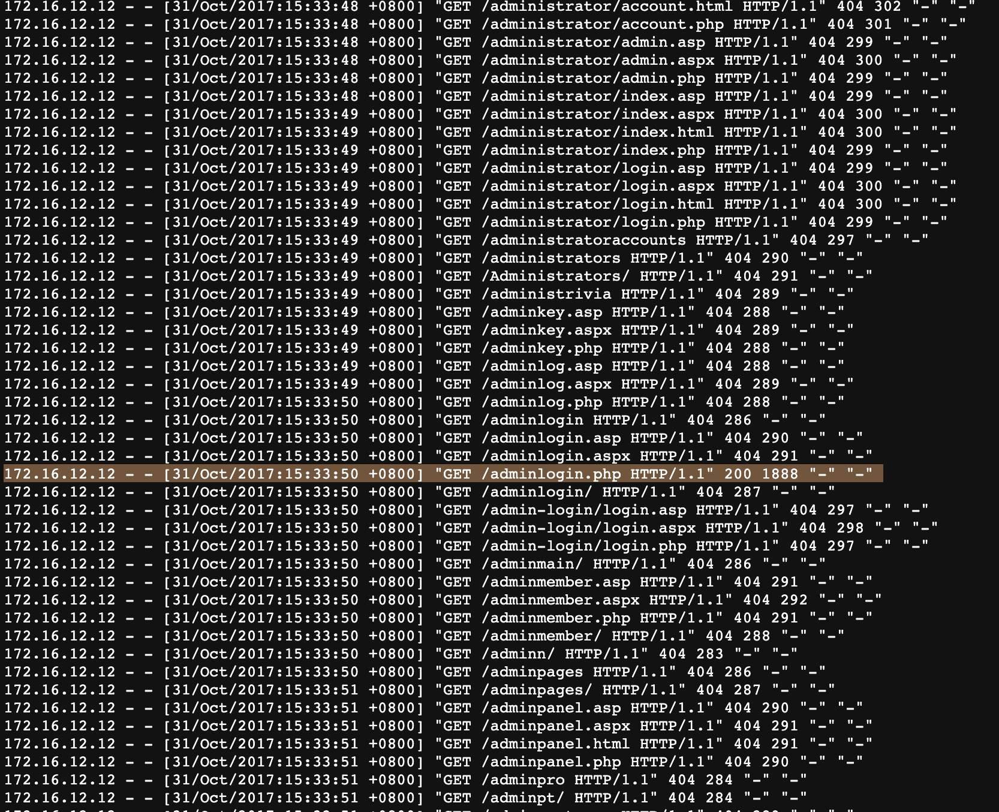
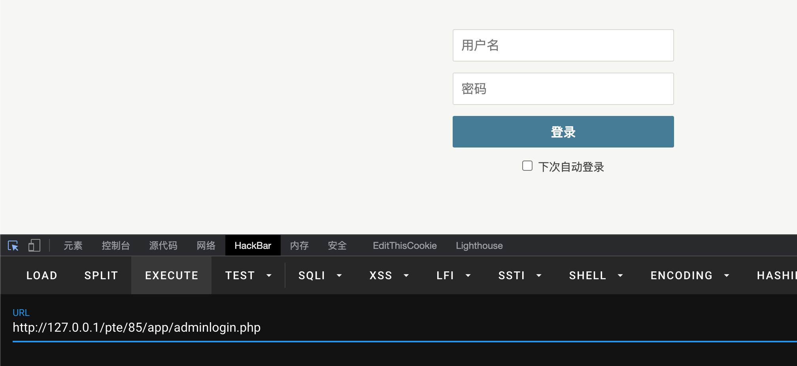

<br/>

# CISP-PTE

CISP-PTE 考试环境源码
## docker

```bash
./start 启动
./stop 关闭
```


## SQL注入

<br/>


<br/>

## 文件上传

<br/>





<br/>

## 文件包含

<br/>



<br/>

<br/>

## 命令执行



<br/>

<br/>

## 日志分析

<br/>

<br/>



爆破

